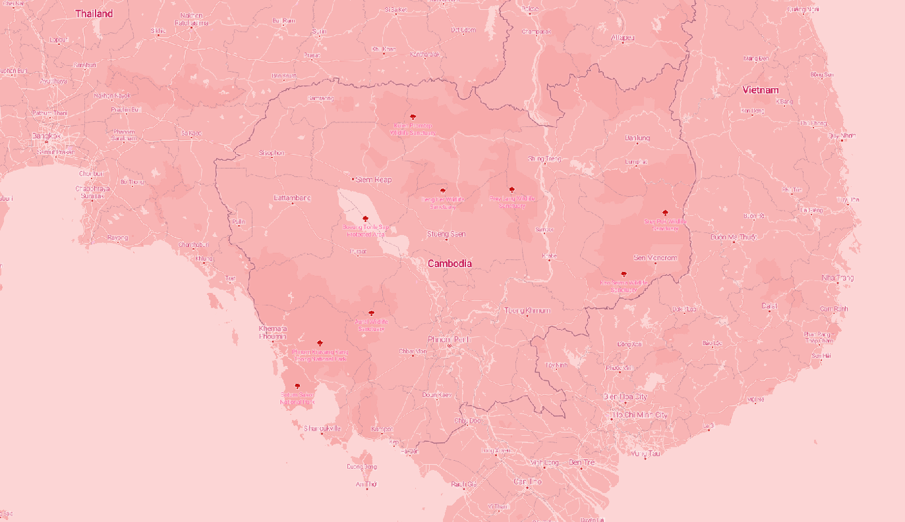
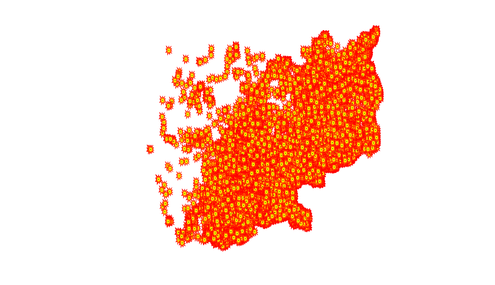
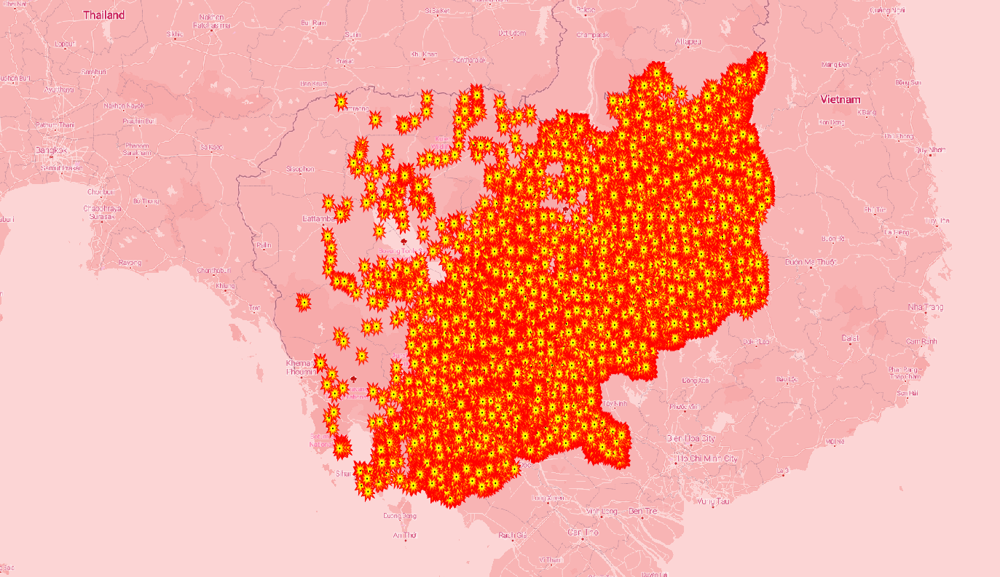
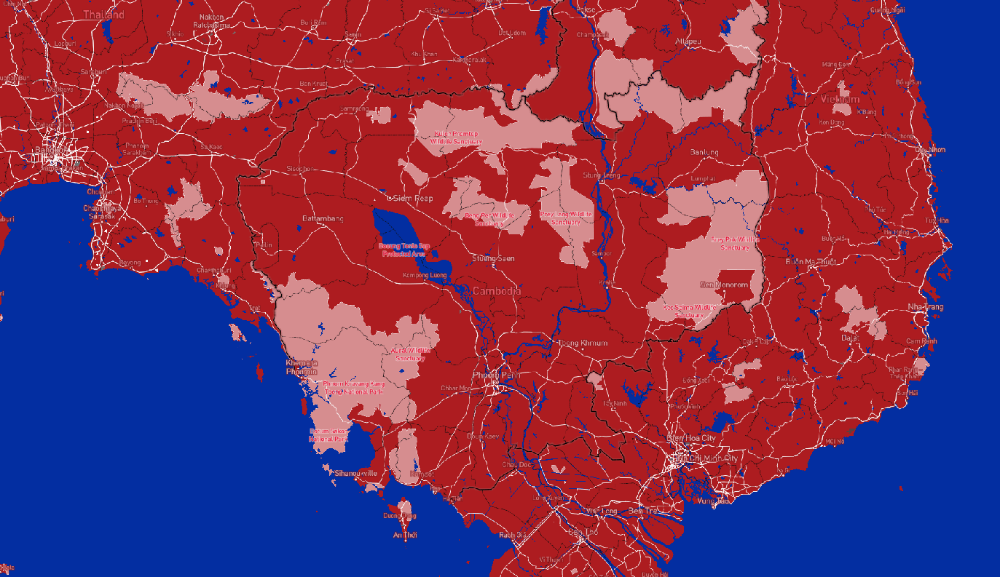

# Map Design and Tiles: Cambodia and The Khmer Rouge Bombings

https://chetva.github.io/mapdesignandtiles/

### Examined Geographic Area
The examined geographic area for all the tile sets is the country of Cambodia located in Southeast Asia. The available zoom level for each tile set are maximum 12 and minimum 8.
### Basemap Tile Set

The basemap tiles were made using Mapbox Studio by customizing the Bubblegum momchrome style. The fonts were changed, label and water colors adjusted, and icons added.
### Bombing Points Tile Set

This data set was an ArcGIS layer obtained from Yale's Cambodian Genocide Program Geographic Database (genocide.studies, yalemaps, https://services1.arcgis.com/7uJv7I3kgh2y7Pe0/arcgis/rest/services/CGP_Vector_Data/FeatureServer)

From the site: " For US bombing points, attributes of a site’s bombardment are displayed in tabular form, e.g. the date of the bombing, exact location, the number and type of aircraft in the sortie, bombing load and ordnance type, the nature of the intended target, and bomb damage assessment (BDA). Individual sortie payloads ranged in size from tens of lbs. to several thousand tons. The dataset details the 42 aircraft types deployed, including B-52's, and the 188 types of munitions they dropped, including 500-lb. 'carpet bombs', cluster bombs, fire bombs and 1000-lb. bombs..The US bombing database was released by the US Embassy in Cambodia to the Royal Cambodian Government and the Cambodian Mine Action Authority (CMAA) to assist in the clearance of unexploded ordnance. "
### Khmer Rouge Bombings Tile Set

The bombings data set is overlayed on the basemap in this tile set. This showed the massive damage Cambodia endured during the Khmer Rouge.

### Cambodian Flag Theme Tile Set

This tile set was made in Mapbox Studio customizing a monochrome style to the colors of the Cambodian flag that is red, white, and blue.
